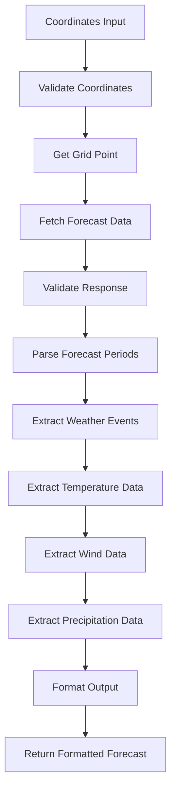
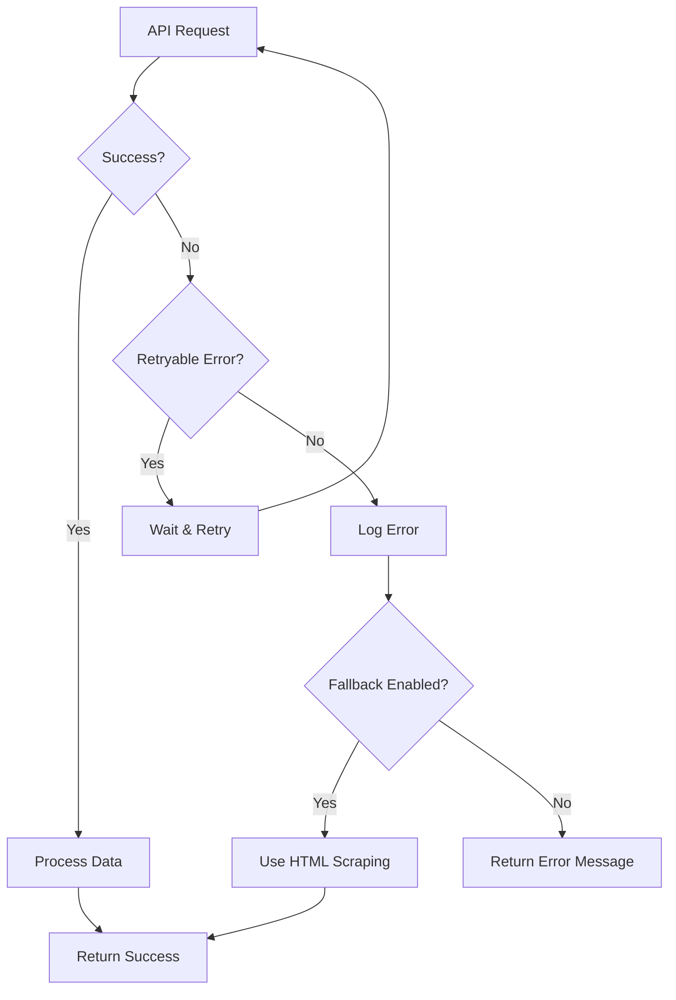
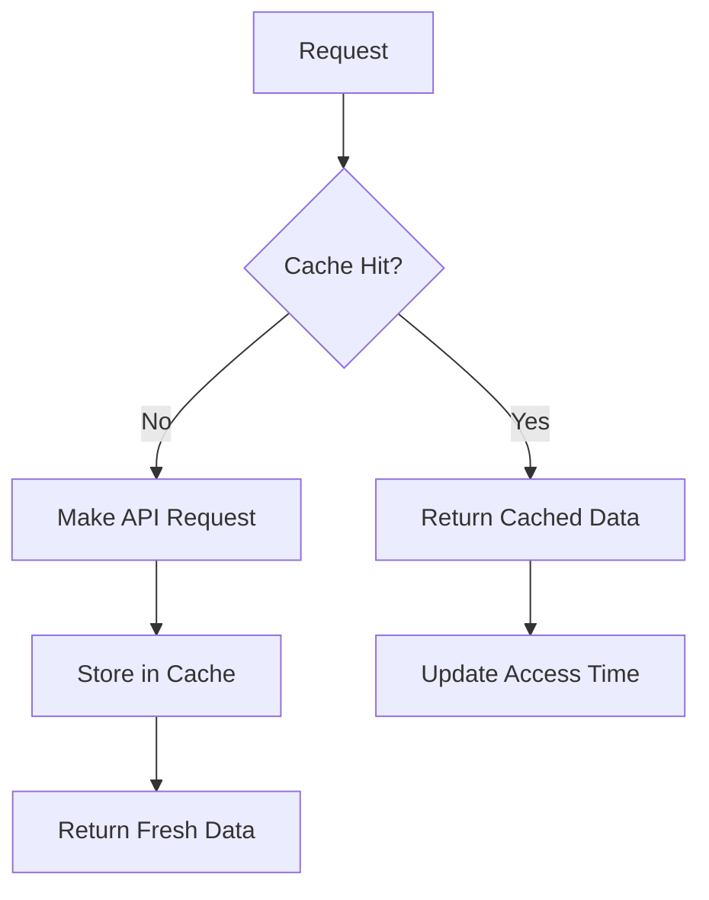

# Weather.gov API Test Implementation - Design Document

## Document Information
- **Version**: 1.0
- **Date**: January 2024
- **Project**: SatCom Forecast API Migration Test
- **Status**: Draft

## Executive Summary

This document provides the detailed technical design for implementing a test version of the Weather.gov API integration to replace the current HTML web scraping approach in the SatCom Forecast system. The design maintains full compatibility with existing functionality while introducing improved reliability and data access capabilities.

## 1. Architecture Overview

### 1.1 Current Architecture
```
Coordinates → NWS Web Interface → HTML Response → BeautifulSoup Parsing → Text Processing → Formatting → Email Delivery
```

### 1.2 New API Architecture
```
Coordinates → Weather.gov API → JSON Response → Data Processing → Formatting → Email Delivery
```

### 1.3 Hybrid Architecture (Test Phase)
```
Coordinates → [API Mode/HTML Mode] → Data Processing → Formatting → Email Delivery
```

## 2. System Components

### 2.1 Core Components

#### 2.1.1 API Client Module (`api_client.py`)
**Purpose**: Handles all interactions with the Weather.gov API

**Key Functions**:
- `get_gridpoint(lat, lon)`: Convert coordinates to NWS grid point
- `get_forecast(office, grid_x, grid_y)`: Fetch forecast data
- `get_alerts(lat, lon)`: Fetch weather alerts (optional)
- `validate_response(response)`: Validate API response structure

**Dependencies**:
- `aiohttp` for HTTP requests
- `json` for data parsing
- `logging` for error tracking

#### 2.1.2 Data Processor Module (`api_data_processor.py`)
**Purpose**: Processes raw API data into structured format

**Key Functions**:
- `parse_forecast_periods(api_response)`: Extract forecast periods
- `extract_weather_events(period_data)`: Detect weather events
- `extract_temperature_data(period_data)`: Extract temperature info
- `extract_wind_data(period_data)`: Extract wind information
- `extract_precipitation_data(period_data)`: Extract precipitation data

**Dependencies**:
- `api_client` for data fetching
- `forecast_parser` for existing parsing logic
- `logging` for processing tracking

#### 2.1.3 Enhanced Forecast Fetcher (`forecast_fetcher_api.py`)
**Purpose**: Main interface for fetching forecasts using API

**Key Functions**:
- `fetch_forecast_api(lat, lon, days)`: Fetch forecast using API
- `fetch_forecast_hybrid(lat, lon, days, mode)`: Fetch using specified mode
- `validate_coordinates(lat, lon)`: Validate input coordinates
- `handle_api_errors(error)`: Handle API-specific errors

**Dependencies**:
- `api_client` for API interactions
- `api_data_processor` for data processing
- `forecast_parser` for formatting
- `logging` for operation tracking

### 2.2 Configuration Components

#### 2.2.1 API Configuration (`api_config.py`)
**Purpose**: Manages API-specific configuration settings

**Configuration Options**:
```python
API_CONFIG = {
    'base_url': 'https://api.weather.gov',
    'user_agent': 'SatComForecast/1.0',
    'timeout': 10,
    'retry_attempts': 3,
    'retry_delay': 1,
    'rate_limit_delay': 0.5,
    'enable_alerts': False,
    'cache_duration': 300
}
```

#### 2.2.2 Feature Flags (`feature_flags.py`)
**Purpose**: Controls API vs HTML mode and rollout features

**Feature Flags**:
```python
FEATURE_FLAGS = {
    'use_api': False,  # Enable API mode
    'fallback_to_html': True,  # Fallback on API failure
    'enable_alerts': False,  # Enable weather alerts
    'enable_caching': True,  # Enable response caching
    'enable_metrics': True,  # Enable performance metrics
    'debug_mode': False  # Enable debug logging
}
```

### 2.3 Data Models

#### 2.3.1 Forecast Period Model
```python
@dataclass
class ForecastPeriod:
    name: str  # "Tonight", "Today", "Monday", etc.
    start_time: str  # ISO 8601 timestamp
    end_time: str  # ISO 8601 timestamp
    is_daytime: bool
    temperature: Optional[int]
    temperature_unit: str
    wind_speed: Optional[str]
    wind_direction: Optional[str]
    short_forecast: str
    detailed_forecast: str
    probability_of_precipitation: Optional[int]
    relative_humidity: Optional[dict]
    heat_index: Optional[int]
    wind_chill: Optional[int]
```

#### 2.3.2 Weather Event Model
```python
@dataclass
class WeatherEvent:
    event_type: str  # "rain", "snow", "fog", etc.
    probability: int  # 0-100
    severity: str  # "low", "medium", "high", "extreme"
    description: str
    keywords: List[str]
```

#### 2.3.3 API Response Model
```python
@dataclass
class APIResponse:
    success: bool
    data: Optional[dict]
    error: Optional[str]
    status_code: Optional[int]
    response_time: float
    cached: bool
```

## 3. Data Flow Design

### 3.1 API Data Flow



### 3.2 Error Handling Flow



### 3.3 Caching Strategy



## 4. API Integration Design

### 4.1 Endpoint Mapping

#### 4.1.1 Coordinate to Grid Point
- **Endpoint**: `GET /points/{lat},{lon}`
- **Purpose**: Convert coordinates to NWS grid point
- **Response**: Grid point coordinates and forecast office
- **Caching**: 24 hours (coordinates don't change)

#### 4.1.2 Forecast Data
- **Endpoint**: `GET /gridpoints/{office}/{gridX},{gridY}/forecast`
- **Purpose**: Get forecast data for grid point
- **Response**: Forecast periods with weather data
- **Caching**: 1 hour (forecast updates frequently)

#### 4.1.3 Weather Alerts (Optional)
- **Endpoint**: `GET /alerts?point={lat},{lon}`
- **Purpose**: Get active weather alerts
- **Response**: Alert information
- **Caching**: 30 minutes (alerts change frequently)

### 4.2 Request/Response Handling

#### 4.2.1 Request Headers
```python
headers = {
    'User-Agent': 'SatComForecast/1.0 (contact@example.com)',
    'Accept': 'application/json',
    'Accept-Encoding': 'gzip, deflate'
}
```

#### 4.2.2 Response Validation
```python
def validate_response(response):
    if response.status_code != 200:
        raise APIError(f"HTTP {response.status_code}")
    
    try:
        data = response.json()
    except json.JSONDecodeError:
        raise APIError("Invalid JSON response")
    
    if 'properties' not in data:
        raise APIError("Missing properties in response")
    
    return data
```

### 4.3 Rate Limiting Strategy

#### 4.3.1 Request Throttling
- **Delay between requests**: 0.5 seconds
- **Concurrent requests**: Maximum 2
- **Retry delay**: Exponential backoff (1s, 2s, 4s)

#### 4.3.2 Caching Strategy
- **Grid point data**: 24 hours
- **Forecast data**: 1 hour
- **Alert data**: 30 minutes
- **Cache size**: Maximum 1000 entries

## 5. Data Processing Design

### 5.1 Forecast Period Processing

#### 5.1.1 Period Extraction
```python
def parse_forecast_periods(api_response):
    periods = []
    forecast_data = api_response['properties']['forecast']['periods']
    
    for period in forecast_data:
        processed_period = {
            'day': period['name'],
            'content': period['detailedForecast'],
            'temperature': period.get('temperature'),
            'wind_speed': period.get('windSpeed'),
            'wind_direction': period.get('windDirection'),
            'precipitation_chance': period.get('probabilityOfPrecipitation', {}).get('value')
        }
        periods.append(processed_period)
    
    return periods
```

#### 5.1.2 Weather Event Detection
```python
def extract_weather_events(period_data):
    events = []
    forecast_text = period_data['content'].lower()
    
    for event_type, keywords in EVENT_TYPES.items():
        if any(keyword in forecast_text for keyword in keywords):
            probability = infer_probability(event_type, forecast_text)
            if probability > 0:
                events.append({
                    'type': event_type,
                    'probability': probability,
                    'description': period_data['content']
                })
    
    return events
```

### 5.2 Data Transformation

#### 5.2.1 Temperature Processing
```python
def extract_temperature_data(period_data):
    temp_info = {}
    
    if period_data.get('temperature'):
        temp = period_data['temperature']
        if period_data.get('isDaytime', True):
            temp_info['high'] = f"H:{temp}°"
        else:
            temp_info['low'] = f"L:{temp}°"
    
    return temp_info
```

#### 5.2.2 Wind Processing
```python
def extract_wind_data(period_data):
    wind_info = None
    
    if period_data.get('windSpeed') and period_data.get('windDirection'):
        speed = period_data['windSpeed']
        direction = period_data['windDirection']
        wind_info = f"{direction}{speed}"
    
    return wind_info
```

## 6. Error Handling Design

### 6.1 Error Categories

#### 6.1.1 API Errors
- **HTTP 4xx**: Client errors (invalid coordinates, rate limiting)
- **HTTP 5xx**: Server errors (API unavailable, internal errors)
- **Timeout**: Request timeout
- **Network**: Connection issues

#### 6.1.2 Data Errors
- **Invalid JSON**: Malformed response
- **Missing Data**: Required fields not present
- **Validation Errors**: Data doesn't meet expected format

### 6.2 Error Handling Strategy

#### 6.2.1 Retry Logic
```python
async def fetch_with_retry(url, max_retries=3):
    for attempt in range(max_retries):
        try:
            response = await session.get(url)
            if response.status == 200:
                return response
            elif response.status >= 500:
                # Server error, retry
                await asyncio.sleep(2 ** attempt)
                continue
            else:
                # Client error, don't retry
                raise APIError(f"HTTP {response.status}")
        except asyncio.TimeoutError:
            if attempt < max_retries - 1:
                await asyncio.sleep(2 ** attempt)
                continue
            raise APIError("Request timeout")
    
    raise APIError("Max retries exceeded")
```

#### 6.2.2 Fallback Strategy
```python
async def fetch_forecast_hybrid(lat, lon, days, mode='auto'):
    if mode == 'api' or (mode == 'auto' and FEATURE_FLAGS['use_api']):
        try:
            return await fetch_forecast_api(lat, lon, days)
        except APIError as e:
            if FEATURE_FLAGS['fallback_to_html']:
                logger.warning(f"API failed, falling back to HTML: {e}")
                return await fetch_forecast_html(lat, lon, days)
            else:
                raise
    else:
        return await fetch_forecast_html(lat, lon, days)
```

## 7. Testing Design

### 7.1 Unit Testing Strategy

#### 7.1.1 API Client Tests
```python
class TestAPIClient:
    async def test_get_gridpoint_success(self):
        # Test successful grid point conversion
    
    async def test_get_gridpoint_invalid_coords(self):
        # Test invalid coordinate handling
    
    async def test_get_forecast_success(self):
        # Test successful forecast retrieval
    
    async def test_get_forecast_api_error(self):
        # Test API error handling
```

#### 7.1.2 Data Processor Tests
```python
class TestDataProcessor:
    def test_parse_forecast_periods(self):
        # Test period parsing from API response
    
    def test_extract_weather_events(self):
        # Test weather event detection
    
    def test_extract_temperature_data(self):
        # Test temperature extraction
    
    def test_extract_wind_data(self):
        # Test wind data extraction
```

### 7.2 Integration Testing Strategy

#### 7.2.1 API Integration Tests
```python
class TestAPIIntegration:
    async def test_end_to_end_forecast(self):
        # Test complete forecast flow
    
    async def test_error_scenarios(self):
        # Test various error conditions
    
    async def test_performance(self):
        # Test response times and memory usage
```

#### 7.2.2 Compatibility Tests
```python
class TestCompatibility:
    def test_output_format_compatibility(self):
        # Test output matches current implementation
    
    def test_character_count_compatibility(self):
        # Test character counts match targets
    
    def test_weather_event_compatibility(self):
        # Test weather event detection accuracy
```

## 8. Monitoring and Logging Design

### 8.1 Logging Strategy

#### 8.1.1 Log Levels
- **DEBUG**: Detailed API request/response data
- **INFO**: Normal operation events
- **WARNING**: Recoverable errors, fallback usage
- **ERROR**: Unrecoverable errors, API failures
- **CRITICAL**: System failures, data corruption

#### 8.1.2 Log Categories
```python
# API Request Logging
logger.info(f"API request: {method} {url}")
logger.debug(f"Request headers: {headers}")
logger.debug(f"Request body: {body}")

# API Response Logging
logger.info(f"API response: {status_code} in {response_time}ms")
logger.debug(f"Response data: {response_data}")

# Error Logging
logger.error(f"API error: {error_type} - {error_message}")
logger.warning(f"Fallback to HTML: {reason}")
```

### 8.2 Metrics Collection

#### 8.2.1 Performance Metrics
- **Response Time**: API request duration
- **Success Rate**: Percentage of successful requests
- **Error Rate**: Percentage of failed requests
- **Cache Hit Rate**: Percentage of cache hits

#### 8.2.2 Business Metrics
- **Request Volume**: Number of requests per hour/day
- **Fallback Usage**: Frequency of HTML fallback usage
- **Data Quality**: Accuracy of weather event detection
- **User Satisfaction**: Based on output quality

## 9. Deployment Design

### 9.1 Rollout Strategy

#### 9.1.1 Phase 1: Internal Testing
- Deploy to development environment
- Test with known coordinate sets
- Validate output compatibility
- Performance testing

#### 9.1.2 Phase 2: Limited Beta
- Deploy to subset of users
- A/B testing between API and HTML modes
- Collect feedback and metrics
- Monitor performance and errors

#### 9.1.3 Phase 3: Gradual Rollout
- Increase percentage of users on API mode
- Monitor system stability
- Collect performance data
- Address any issues

#### 9.1.4 Phase 4: Full Migration
- All users on API mode
- Remove HTML scraping code
- Optimize based on real-world usage
- Final performance tuning

### 9.2 Configuration Management

#### 9.2.1 Feature Flags
```python
# Production configuration
FEATURE_FLAGS = {
    'use_api': True,
    'fallback_to_html': True,
    'enable_alerts': False,
    'enable_caching': True,
    'debug_mode': False
}

# Development configuration
FEATURE_FLAGS = {
    'use_api': True,
    'fallback_to_html': True,
    'enable_alerts': True,
    'enable_caching': False,
    'debug_mode': True
}
```

#### 9.2.2 Environment Variables
```bash
# API Configuration
WEATHER_API_USER_AGENT="SatComForecast/1.0"
WEATHER_API_TIMEOUT=10
WEATHER_API_RETRY_ATTEMPTS=3
WEATHER_API_CACHE_DURATION=300

# Feature Flags
WEATHER_USE_API=true
WEATHER_FALLBACK_HTML=true
WEATHER_DEBUG_MODE=false
```

## 10. Security Design

### 10.1 Input Validation
- **Coordinate Validation**: Ensure lat/lon are within valid ranges
- **Day Range Validation**: Ensure days parameter is 1-7
- **Response Validation**: Validate API response structure
- **Data Sanitization**: Sanitize all user inputs

### 10.2 Error Information
- **No Sensitive Data**: Don't log sensitive information
- **Generic Error Messages**: Provide user-friendly error messages
- **Debug Information**: Only log detailed errors in debug mode
- **Error Classification**: Categorize errors for appropriate handling

### 10.3 Rate Limiting
- **Request Throttling**: Implement delays between requests
- **Concurrent Limits**: Limit concurrent API requests
- **Backoff Strategy**: Use exponential backoff for retries
- **Circuit Breaker**: Implement circuit breaker for API failures

## 11. Performance Design

### 11.1 Caching Strategy
- **Grid Point Caching**: Cache coordinate-to-gridpoint conversions
- **Forecast Caching**: Cache forecast data with appropriate TTL
- **Response Caching**: Cache processed responses
- **Cache Invalidation**: Implement proper cache invalidation

### 11.2 Memory Management
- **Data Cleanup**: Clean up processed data after use
- **Cache Limits**: Implement cache size limits
- **Memory Monitoring**: Monitor memory usage
- **Garbage Collection**: Ensure proper garbage collection

### 11.3 Response Time Optimization
- **Parallel Requests**: Make concurrent requests where possible
- **Data Processing**: Optimize data processing algorithms
- **Caching**: Use caching to reduce API calls
- **Connection Pooling**: Reuse HTTP connections

## 12. Maintenance Design

### 12.1 Code Organization
- **Modular Design**: Separate concerns into modules
- **Clear Interfaces**: Define clear interfaces between components
- **Documentation**: Comprehensive code documentation
- **Testing**: Comprehensive test coverage

### 12.2 Monitoring and Alerting
- **Health Checks**: Regular health check endpoints
- **Error Alerting**: Alert on critical errors
- **Performance Monitoring**: Monitor response times and throughput
- **Usage Analytics**: Track usage patterns and trends

### 12.3 Update Strategy
- **Version Control**: Use semantic versioning
- **Backward Compatibility**: Maintain backward compatibility
- **Rollback Plan**: Plan for quick rollback if needed
- **Testing**: Comprehensive testing before updates

---

**Document Approval**
- [ ] Technical Lead Review
- [ ] Architecture Review
- [ ] Security Review
- [ ] Final Approval

**Document History**
- v1.0 - Initial design based on API Migration Report and requirements analysis